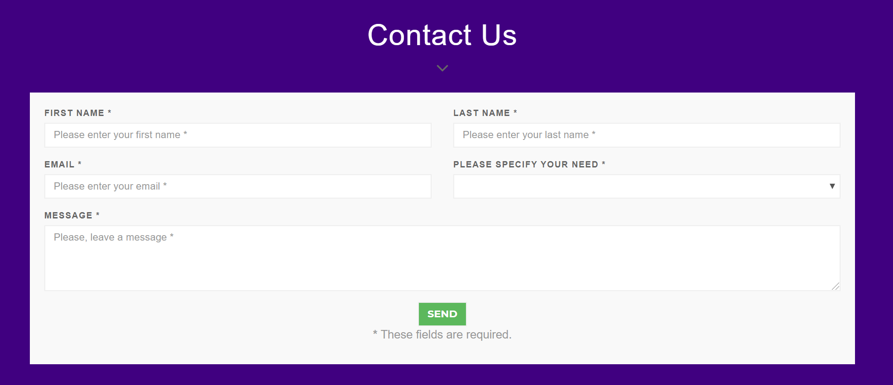

# DWELLING: We look for you the place you dream

Members: 

* @asrivasts - Anu Srivastava
* @Bulinche - Luis Hernandez
* @oik01 - Omar Kreidieh
* @mariavpatino - Victoria Patiño

[Final Presentation](https://prezi.com/view/1DNEz5tRKtxSKaiDyBqt/)

 

## ABOUT

Realty based consumer database where information is combined from several data sources into a single searchable resource for homes and neighborhoods. 
This database displayed in a Web Page will seek to combine vital information like school system information, and commuter scores into a single searchable resource.

Technology Used:
- Python
- HTML/CSS/Bootstrap/Javascript
- Flask
- MongoDB  

 

## PROCESS
### Dataset

* Zip Code, City and House Type: MLS web page (scraped)
* [High School Rankings](https://api.schooldigger.com/v1.2/rankings/schools/NJ?level=High&perPage=50&appID=4199a348&appKey=5d16139d9ca9a3a48f2e4d3ac749468f)
* [Transportation](https://njogis-newjersey.opendata.arcgis.com/datasets/d1b2669cd9bf4ab6bb8e04f5326e8d77_9/data?orderBy=COUNTY)  

### Project Steps:

1. Assemble list of available properties in NJ and characteristics from MLS (through web scraping).
2. Use the location parameters (lat, long) to obtain the relevant data from the other data sources  as commuter score and education). 
3. Combine all the data in MongoDB.
4. Present the data using Flask, bootstrap, d3, mapping etc.  

 

## GETTING THE DATA

### MLS Web Scraping : 
Extracting the Real Estate listings, Zip Code and Cities from the MLS page.   

### NJ Transit Data:
CSV and JSON format: [NJ Transit Data](https://github.com/mariavpatino/Dwelling-Project/tree/master/NJ%20Transit%20Data)

### School Data:
The high schools were taken from the API from "School Digger" based on test scores provided by the New Jersey Department of Education. That is the top 50 high schools with the best academic results.   

 

## STORING THE DATA

### Database Creation
The data extracted (house data, school data, and transportation data) is stored in collections in the Dwelling_db database in MongoDB.  

 

## FLASK 
Creating Interactivity.  

## FRONT-END (Visualizations)
Home Page: 

 

Map with the filters: 

 

Map with the filters: 

 

### Additions:
* About: 

 

* Contact Us Format: 

